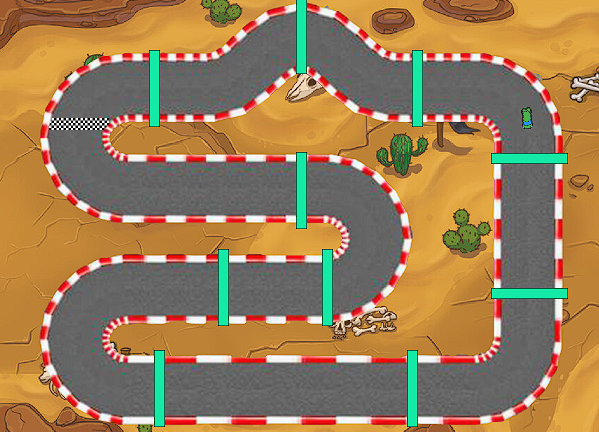
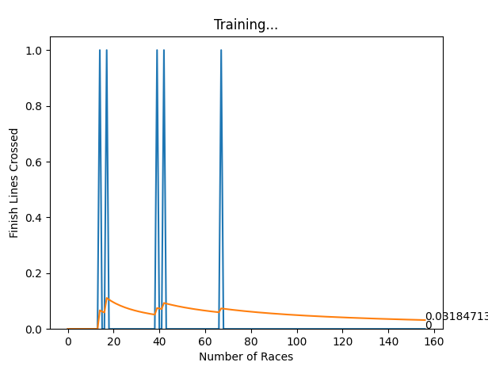
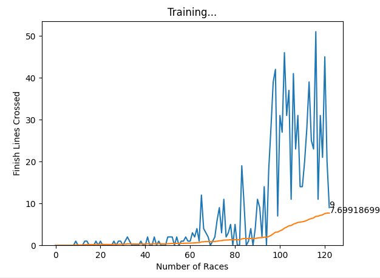

<h1 align="center">Q-Learning Racing Game Project</h1>

  

  

  

  

This project is intended to showcase our knowledge learning about Neural Network Design by developing an AI agent capable of playing a 2-dimensional racing game using Q-learning. The goal is to showcase the effectiveness of Q-learning in training an AI to perform a task optimally by rewarding positive behavior and punishing negative behavior. The project not only demonstrates the capabilities of Q-learning but also emphasizes its broad applicability to various scenarios beyond gaming.

# Tools Used in this Project

- Python
- Pygame
- Q-Learning Algorithm
- Numpy
- PyTorch

# Development Environment

- VS Code
- Terminal
- Windows 10

# Team / Contributors / Teachers

- [Mitchell Kolb](https://github.com/mitchellkolb)
- [Flavio Alvarez Penate](https://github.com/f-alvarezpenate)
- Professor. Yan Yan

# Project Overview

This project utilizes Q-learning to train an AI agent to navigate and complete a 2-dimensional racing game. The AI agent starts with no prior knowledge and learns to drive around the track by receiving rewards for positive actions (e.g., moving towards the finish line and mini finish lines placed throughout the track) and punishments for negative actions (e.g., hitting the track border). The Q-learning algorithm updates the Q-values for each state-action pair iteratively, allowing the AI to optimize its behavior over time after its failures.

## Project Details

### Introduction
In this project, we apply Q-learning to train an AI agent to drive a car in a top down racing game we quickly created in pygame. Through a reward and punishment system known as Q-learning, the AI learns to navigate the track successfully, avoiding obstacles and completing laps efficiently. On game startup, the AI has no understanding of the game environment it only knows that it wants more positive attributes given to it than negative.

### Literature Review
In this we drew inspiration from various sources, including video tutorials online for pygame creation and research on reinforcement learning. Notably, a tutorial on training an AI lizard to navigate tiles in a game provided foundational insights into Q-learning's reward-based system. Additionally, articles and tutorials on Q-learning and deep reinforcement learning informed our implementation, helping us understand the mathematical foundations and practical applications of these algorithms.

### Technical Plan
The project employs a Q-Table to store the expected future rewards for each state-action pair. The Q-learning algorithm uses the Bellman equation to update these values iteratively. We chose a 2-dimensional racing game as our environment due to its clear reward system and straightforward failure detection. The AI agent, implemented using Python and Pygame, learns to drive the car around the track by receiving rewards for crossing checkpoints and the finish line and punishments for hitting the track border.

### Implementation Details

#### Files and Structure
- `game.py`: Contains the racing game environment and controls the car's movement.
- `agent.py`: Implements the Deep Q-Learning algorithm, including the agent's actions and training process.
- `aiModel.py`: Defines the neural network architecture and the training process using PyTorch.
- `graph.py`: Plots the AI's performance over time, showing the number of finish lines crossed during training.
> [!NOTE]
> These files were created and submitted on campus systems because of the time constraint and computational power required to run this project. Our team did not store them locally. The files in this repo are early renditions of what would come to be our final codebase before we transfered over to the other systems.

### Q-Learning and Deep Q-Learning Implementation
In this project, Q-learning is used to train the AI agent by updating Q-values based on rewards and punishments. The algorithm helps the AI learn the optimal actions to take in different states of the racing game. To enhance the learning process, Deep Q-Learning combines Q-learning with neural networks, which approximate the Q-values and reduce the number of trials needed for effective learning.

#### Results and Observations
During development, we encountered challenges in designing an effective reward system and implementing collision detection. By refining the reward system and fixing bugs, we improved the AI's performance. The AI learned to navigate the track more efficiently, showing significant progress over time. Our final implementation demonstrated the AI's ability to complete laps and optimize its route, proving the effectiveness of Q-learning and Deep Q-Learning in training AI for this task. Below is the results of our first and final learning cycle as we improved apon the AI model parameters and learning qualities throughout the project.

  
  

#### Future Work
Future improvements could include enhancing the collision mechanics to reset the game upon crashing, adjusting reward values for checkpoints, and refining the hitbox for better accuracy. Additionally, exploring other reinforcement learning algorithms could provide further insights into optimizing AI behavior.

## References
1. [Exploration vs. Exploitation - Learning the Optimal Reinforcement Learning Policy](https://www.youtube.com/watch?v=mo96Nqlo1L8)
2. [An Introduction to Q-Learning: Reinforcement Learning](https://www.freecodecamp.org/news/an-introduction-to-q-learning-reinforcement-learning-14ac0b4493cc)
3. [Playing Geometry Dash with Convolutional Neural Networks](http://cs231n.stanford.edu/reports/2017/pdfs/605.pdf)
4. [Q-Learning Explained - A Reinforcement Learning Technique](https://www.youtube.com/watch?v=qhRNvCVVJaA&list=TLPQMjAwMjIwMjP5wYy7pRhaxg&index=2)
5. Shyalika, Chathurangi. [A Beginners Guide to Q-Learning](https://towardsdatascience.com/a-beginners-guide-to-q-learning-c3e2a30a653c)
6. [Getting Started - wiki](https://www.pygame.org/news)
7. Analytics Vidhya, [Introduction to Deep Q-Learning for Reinforcement Learning (in Python)](https://www.analyticsvidhya.com/blog/2019/04/introduction-deep-q-learning-python)
8. Achiam, J., & Abbell, P. [Welcome to Spinning Up in Deep RL!](https://spinningup.openai.com/en/latest/index.html)
9. Willems, L. [LCSWILLEMS/RL-starter-files: RL starter files in order to immediately train, visualize and evaluate an agent without writing any line of code](https://github.com/lcswillems/rl-starter-files)
10. Paszke, A. [Reinforcement Learning (DQN) Tutorial](https://pytorch.org/tutorials/intermediate/reinforcement_q_learning.html)

